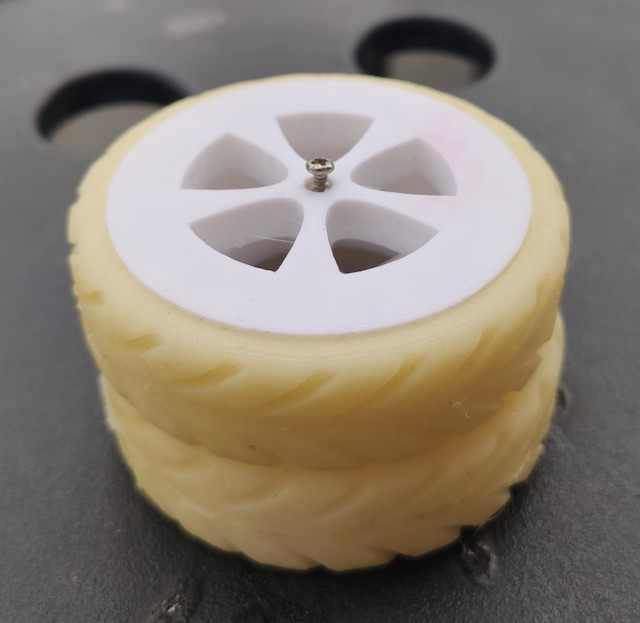
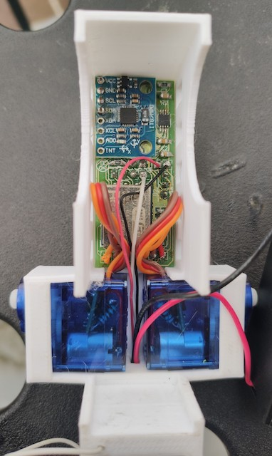
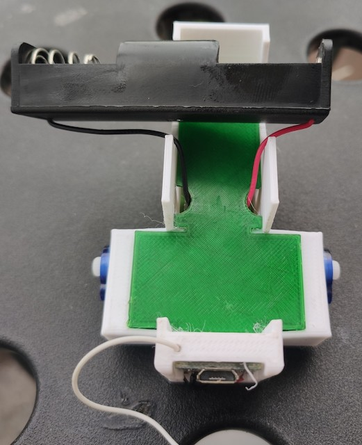
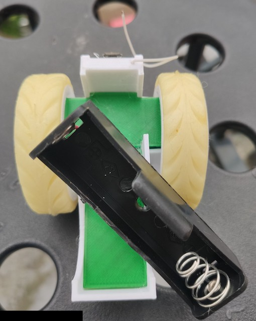
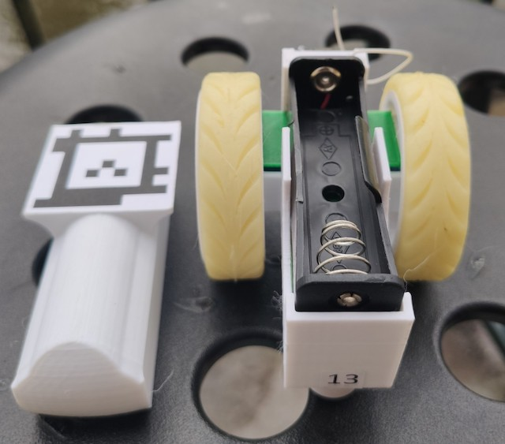
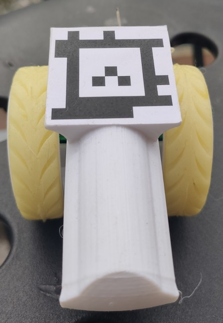
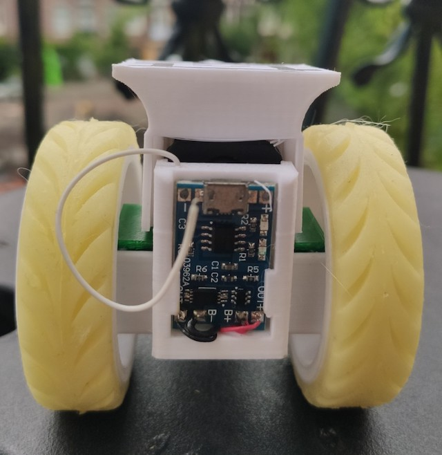
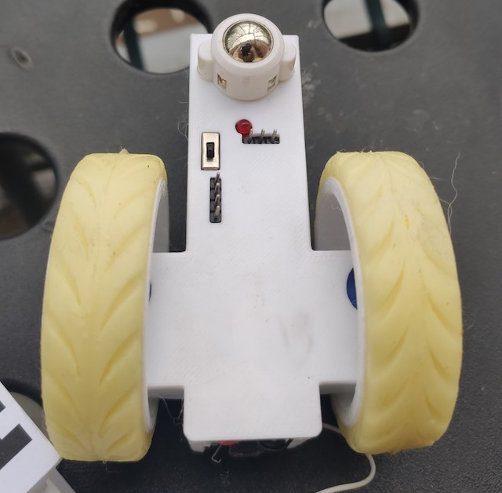

## 3D Printing some parts for your Minibot

Here you will find all the parts you need to print in order to assembly your Minibot. Print the followint itens and prepare the [Printed Circuit Board - PCB](/02_BotPCB) to assemble your Minibot:

 - [Chassis](stl/01_Chassis.stl)
 - [Wheel (x2)](stl/02_Wheel.stl)
 - [Cover Shell](stl/21_MinibotShell.stl)
 - PCB Cover: Depending on the size of your servo (yes, it varies a lot from vendor to vendor), choose: [Big](stl/04_PCBCoverBig.stl) or [Small](stl/05_PCBCoverNormal.stl)

<table>
  <tr>
    <td align="center">Wheels</td>
    <td align="center">PCB with servos</td>
    <td align="center">Chassis cover</td>
    <td align="center">Wheels installed</td>
  </tr>
  <tr>
    <td align="center"></td>
    <td align="center"></td>
    <td align="center"></td>
    <td align="center"></td>    
  </tr>
  <tr>
    <td align="center">Without shell - battery slot</td>
    <td align="center">Top vision with shell</td>
    <td align="center">Rear view - battery recharger</td>
    <td align="center">Bottom view</td>
  </tr>
  <tr>
    <td align="center"></td>    
    <td align="center"></td>
    <td align="center"></td>
    <td align="center"></td>
  </tr>
</table>

## Preparing the tyres
You can make tyres for your Minibot with Silicon and Cornstarch! :) Yeah, that's it. To do that, you just need to 3D print the mold:
 - [Mold part A](stl/32_TyreModePartA.stl)
 - [Mold part B](stl/33_TyreModldPartB.stl)
 
Then you just need to prepare the silicon the way it is explained here in this video: https://www.youtube.com/watch?v=u9VzjrzLDiE&pbjreload=101

Put the silicone in both parts of the mold, close it tightly and wait for ~2hs before opening it. Keep in mind the the cure time for this formula is something like 24hs. So, don't stretch or try to put it in the wheel before that time. IMO you achieve better by letting the tyres to cure for 48hs.

