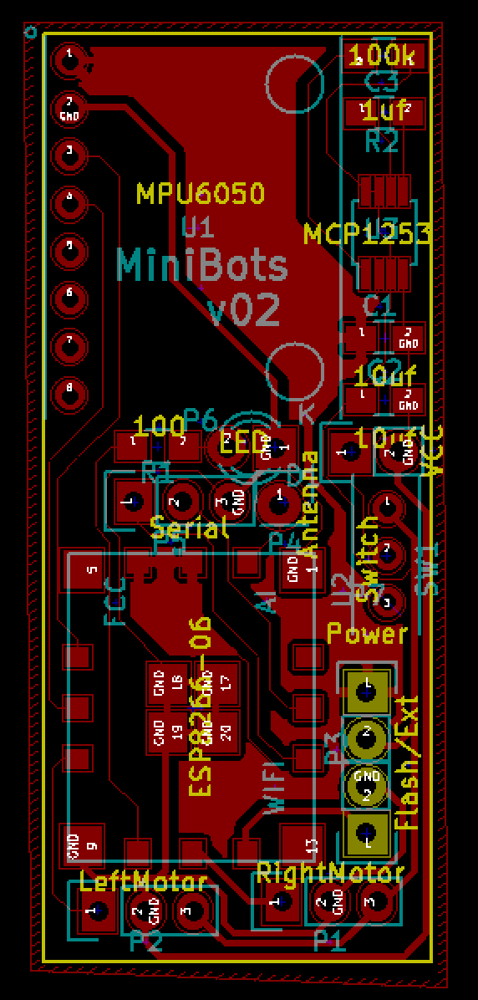
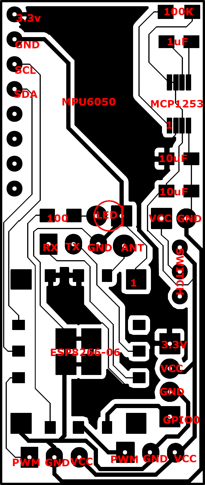
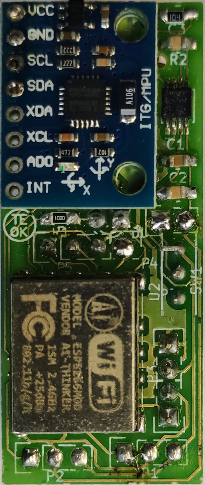
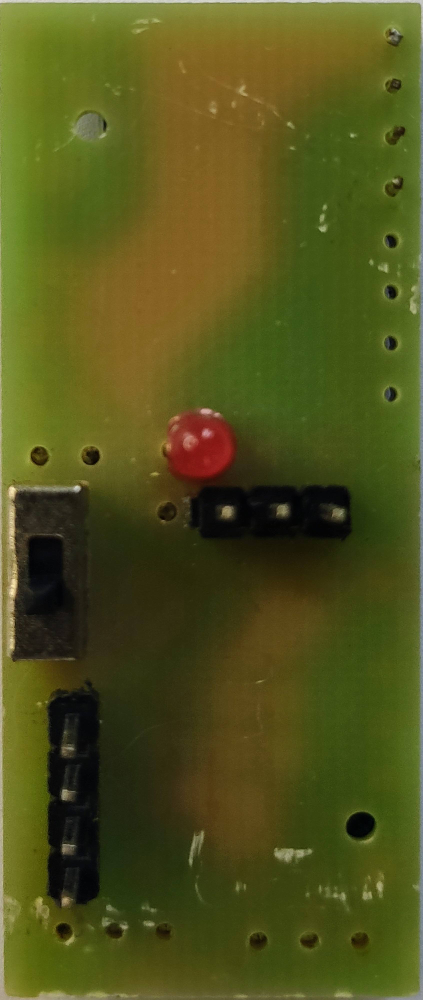
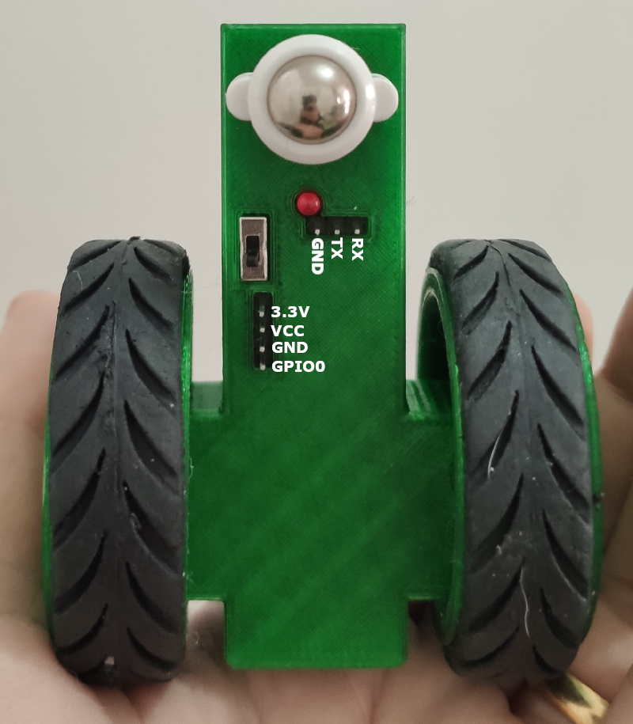

## Preparing the PCB

Minibots is based on a very popular and cheap uController, the . So, the PCB is basically this uController connected to two servos (controlled by PWM) and other elements, like the classic accelerometer+gyroscope MPU6050, external pins, control LED, etc.

The PCB was created with  **v4.0.2+dfsg1-stable** and you can see the KiCad project in this directory. The Gerber files can also be found in this dir. In order to manufacture a new PCB for you Minibot, you can use the Gerber files. If you never created a PCB before, you can use some online services that you just upload the Gerber files, pay for the boards and you then receive the boards at your home. The project is very simple. It has just one layer and you can make tracks with **copper 2Oz**.

<table>
  <tr>
    <td>PCB Layout</td>
    <td>Connections</td>
    <td>Top</td>
    <td>Bottom</td>
  </tr>
  <tr>
    <td></img></td>
    <td></img></td>
    <td></img></td>
    <td></img></td>
  </tr>
</table>

As you can see above, the layout is very simple and the list of components (BOM) is:
 - D1: LED-3MM
 - P1: Pin_Header_Straight_1x03 ; LeftServo (Micro Servo 9g SG90 with 360o hack)
 - P2: Pin_Header_Straight_1x03 ; RightServo (Micro Servo 9g SG90 with 360o hack)
 - P4: Pin_Header_Straight_1x01 ; Antenna
 - P5: Pin_Header_Straight_1x03 ; Serial
 - SW1: MiniSlideSwitch ; [Switch specs](imgs/mini_switch.jpg)
 - U1: MPU6050 ; MPU6050
 - C1,C2: C_0805_HandSoldering ; 10uf
 - C3: C_0805_HandSoldering ; 1uf
 - R2: R_0805_HandSoldering ; 100k
 - U3: MSOP-8_3x3mm_Pitch0.65mm ; MCP1253
 - R1: R_0805_HandSoldering ; 100
 - P6: Pin_Header_Straight_1x02 ; VCC
 - P7: Pin_Header_Straight_1x02 ; Power
 - P3: Pin_Header_Straight_1x02 ; Flash/Ext
 - U2: ESP8266-06
 
 ### Considerations
 You need to have some soldering skills to put all the components on the board. The uController requires an SMD soldering station, but the rest of the components can be soldered by just using a normal iron.
 
 **Micro Servo 9g SG90** is a 180 degrees servo. You need to hack it to transform it into a continuous servo (360 degrees). There are tons of tutorials on the Internet teaching how to do that. Here it is an example: https://rookieelectronics.com/servohack/
 
 **MCP1253** is a power pump, it improves the battery energy utilization and also works as a power regulation. It's mandatory to keep the correct voltage (3.3v) all the time to the uController. It also works as a power isolation, given the servos are connected directly to the battery and the rest of the circuit is feed by the power pump.
 
 **ESP8266** package 04 was used in the original project, but this packaging was discontinued, so, in v02 (this version) the package 06 was used. It is easier to find on the Internet but it is more difficult to be soldered, given it requires a Rework station (SMD soldering machine with hot air).
 
 **SMD** is important to keep the size of the board in general. You can see that all the resistors and capacitors are **SMD 0805**.
 
 
 Bottom view of the Minibot after finishing the assembly in the 3D printed Chassis:  
</img>
 
