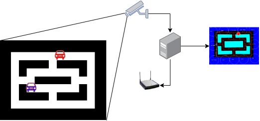

## SmartCity Example
The idea of this project is to simulate a minimalist (smart) city. People go around by car from one place to another during the rush hour. Traffic jams are inevitable. With the help of a Smart City, the drivers can change/optimize the routing, on-the-fly, based on "what the city sees and notifies to each car". 

So, with the use of a webcam, the city keeps "looking all the time" to the cars, pedestrians, obstacles, the streets, etc. A backend (written in C++ for performance reasons) process the video streaming from the camera and applies a set of rules to understand the current scenario and infer a better state for the city. This backend is the Smart City controller. It communicates to all the cars and the traffic lights trough UDP. All the elements share the same network.

Each car, pedestrian, obstacle and place has an [Apriltag](https://april.eecs.umich.edu/software/apriltag). Apriltags are powerful visual markers used for experimenting with robotics and augmented reality. By processing the Apriltags, the backend identifies the position and orientation of all detected elements in the scene. These coordinates are then used to compute improvements in the routing.

The city has a representation of the track as a connected graph. For the path planning, A*. Both graph and path planner algorithms were implemented in an external library called [PowerGine](https://github.com/samir-souza/powergine).

For this project, a tripod with a Raspbery pi4 camera support was created. You can make your own tripod by PVC tubes and just one 3D printed part, as you can see in the picture bellow: 
<p align="center">
</img>
</p>

This project was created as a Proof of concept for the Minibots and was presented at the Builders Fair at re:Invent 2019. 

### How the Backend works

<p align="center">
</img>
</p>

Each captured frame is processed by the backend in a simple computer like a raspberry pi 4. After processing all the elements from a given frame, the Backend updates the map. A Map in this context is the spacial representation of the elements and their current state. This map is updated after each frame is processed. There is a visual debugger integrated with the Backend. It uses OpenCV to render the current state of the map in a screen. Here it is an example of this debugger showing:

<p align="center">
</img>
</p>

#### Path planning
When the city detects that there is a better path for a given routing, it replans the path and then send this information to the bots. The bots in this demo are just following all the commands sent by the backend. In a real life scenario, this notification could be a message sent by the city to the driver and this particular driver then can use that info to take a decision.

### Compiling from Source
Please use this [Dockerfile](Container/Dockerfile) as a reference for building the backend from source. You'll notice that this project requires a few libraries:
 - [Powergine](https://github.com/samir-souza/powergine): A minimalist game engine for experimentation. We'll use the graph and path planner (A*) moduler from that lib
 - [Apriltag](https://github.com/AprilRobotics/apriltag.git): A library for parsing markers that represent the orientation and position of moving objects
 - [OpenCV](https://github.com/opencv/opencv.git): The classic Computer Vision lib

# Running the backend (requires a webcam)
./minibots -p

### Simulator
If you want to experiment with the algorithms that you can use in this city, you can use the Simulator provided by this project.

The simulator produces a similar output as a camera, positioned on top of the track, would create. With this Simulator you can debug and also experiment different controllers. Maybe Reinforcement Learning?

Click on the image bellow to watch a video that shows the simulator (at the left side) and the debugger of the backend (at the right side).
<p align="center">
  <a href="https://spock.cloud/minibots/simulator.mp4"></a>
</p>

The Simulator is a python 3 Script that uses [Pygame](http://pygame.org/) as the graphic renderer. Take a look at the dir: [Bot Simulator](BotSimulator) for more details.

It requires a few libraries and you can install them by running:
```bash
pip3 install pygame==2.0.0.dev6
pip3 install numpy
pip3 install opencv-python
```

If you want to try the simulator, you need to ask the backend not to look for a webcam and instead prepare a UDP server to receive the frames from the simulator.
```bash
# In the backend build dir
./minibots -p -s localhost:9991
```

Then in another terminal (tab?)
```bash
# In the simulator dir
python3 main.py
```
