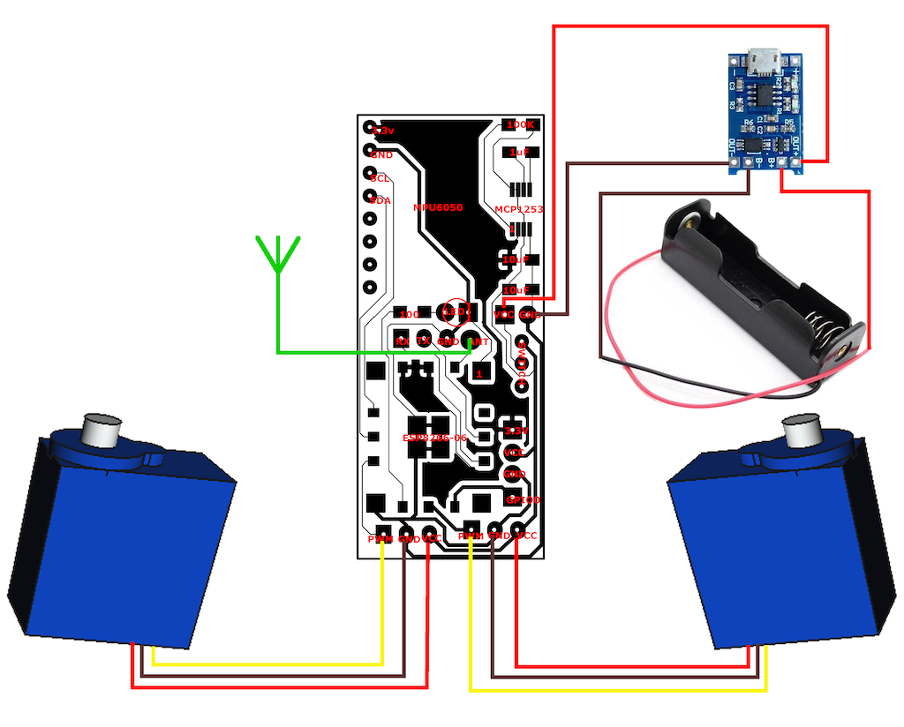

## Assembling your Minibot

Before you start, make sure you already followed all the instructions in the three parts of this project and prepared the 3D printed parts and the PCB + installed the firmware.
  - [3D Models](/01_3DModels)
  - [Bot PCB](/02_BotPCB)
  - [Bot Firmware](/03_BotFirmware)

### Putting everything together

Let's start with a list of the components you need to complete this project:
  - [3D printed](/01_3DModels)
    - Two wheels
    - Chassis
    - PCB cover
    - Minibot Shell (cover)
  - [PCB](/02_BotPCB) (with all the components already soldered)
  - Two hacked servos (continuous rotation + use a cutting pliers to remove the flaps)
  - Two tyres
  - Caster wheel
  - Battery recharger module TP4056
  - Hard wire for the Antenna
  - 3.7v Single 18650 Battery Holder
  - Rechargeable 3.7v 18650 Battery
  
<table>
  <tr>
    <td align="center">Battery recharger TP4056</td>
    <td align="center">Caster wheel</td>
    <td align="center">3.7v Single 18650 Battery Holder</td>
 </tr>
 <tr>
   <td align="center"></td>
   <td align="center"></td>
   <td align="center"></td>
 </tr>
</table>

**TIP:** You need to cut the Servos wires to solder them to the PCB. Keep the wires to use them to connect the TP4056 to the PCB. Take a look on the Picture bellow called "PCB with servos" to have an idea of how to connect all the elements together.

<table>
  <tr>
    <td align="center" colspan="4">Hacked Servo 9g S90</td>
 </tr>
 <tr>
   <td align="center"></td>
   <td align="center"></td>
   <td align="center"></td>
   <td align="center"></td>
 </tr>
</table>

**TIP:** *Micro Servo 9g SG90* is a 180 degrees servo. You need to hack it to transform it into a continuous servo (360 degrees). There are tons of tutorials on the Internet teaching how to do that. Here it is an example: https://rookieelectronics.com/servohack/

Alright! So, now that you have all the components, use the following diagram to guide you during the soldering/connecting:

**ATTENTION:** Before soldering the battery recharger and the battery holder, pass the wires through a (squared) hole in the chassis that goes from the servos area to the back of the Minibot. Then you can finish to install the servos and the PCB inside the chassis and put the PCB Cover. After that you can cut the wires to the right size, slide the battery recharger (TP4056) to the correct place (picture bellow) and finally you can solder the wires from the battery holder and the power connection to the recharger. Put a drop of hot glue at each side of the recharger to get a better fixation.

<table>
  <tr>
    <td align="center">Wheels</td>
    <td align="center">PCB with servos</td>
    <td align="center">Chassis cover</td>
    <td align="center">Wheels installed</td>
  </tr>
  <tr>
    <td align="center"></td>
    <td align="center"></td>
    <td align="center"></td>
    <td align="center"></td>    
  </tr>
  <tr>
    <td align="center">Without shell - battery slot</td>
    <td align="center">Top vision with shell</td>
    <td align="center">Rear view - battery recharger</td>
    <td align="center">Bottom view</td>
  </tr>
  <tr>
    <td align="center"></td>    
    <td align="center"></td>
    <td align="center"></td>
    <td align="center"></td>
  </tr>
</table>

When attaching the wheels to the servos, just put a little preasure on it to fit it all the way. Then, use the screws that come with the servos to fix the wheels.

