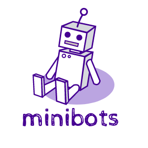
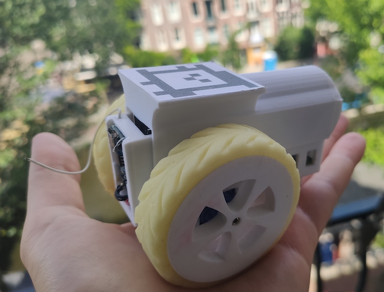
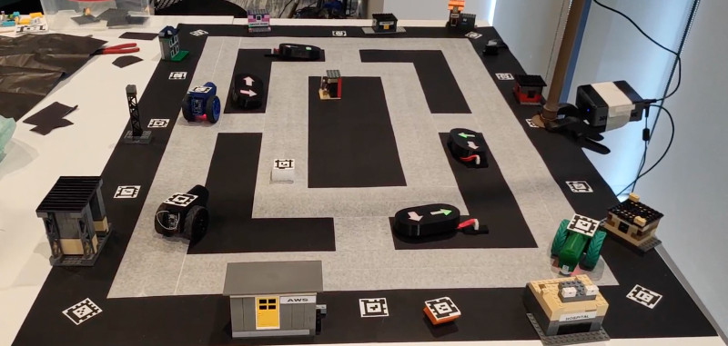

</img>  

**minibots** is an open source and open hardware platform for experimenting with autonomous bots, Machine Learning and Programming. You can download the code and the assets to create your own fleet of bots, using a 3D printer and some basic electronic components. It is based on the ESP8266 uController, but you can modify it and use any uController you want. 
 
   

</img>

## Smart City with minibots
In this repo you will find a demo of a Smart City simulation. The idea of this demo is to use **minibots** to 
represent cars moving around on the streets of a city. There are a few places around the track like: houses, gas stations, buildings, etc.
The cars are going from on place to another, simulating a rush hour and generting traffic jams. The targets are selected randomly, and
each car automatically selects the next random target as soon as it gets to the current target place. The controller will try to 
re-route the cars to alternative paths to alleviate the traffic. You can also make the things worse by manually adding some 
obstacles to the streets, like: dogs, pedestriang, etc.
Also, there is a special marker that you can put close to a place. It will bias the next target selected by the first car that finishes the current path.  

 </img>

 

[Click here for more details about this demo](04_Examples/01_SmartCity)

## Components

A Minibot is composed by three modules: 1) the 3D printed parts and a few other parts; 2) the bot Printed Circuit Board (PCB); and 3) the firmware;

### 3D Models
In the first module [3D Models](01_3DModels) you will find the STL files and the FreeCAD projects used to build this project. Just follow the instructions on the module page "[3D Models](01_3DModels)" to get the files and print them.
### Bot PCB
In the second module [Bot PCB](02_BotPCB) you will find instructions about how to create the Printed Circuit Board for your Minibot. Also, you'll find the [Gerber files](https://en.wikipedia.org/wiki/Gerber_format), required for manufacturing the PCB and the components list.
### Firmware
In the third module [Firmware](03_BotFirmware) you will find the binary images and a Dockerfile that you can use to hack and customize the firmware of your Minibot. The firmware is for the uController ESP8266 and is based on Nodemcu LUA: https://nodemcu.readthedocs.io/en/master/. So, after installing the Nodemcu firmware you can customize the Lua scripts to adapt your Minibot to any project.

## Assembling
Click on [ASSEMBLING](ASSEMBLING.md) to see the instructions of how to create your own Minibot from scratch.

# License
The 3D Models and the PCB projects are released in Creative Commons Attribution-ShareAlike 4.0 License and the source code available in this repository is licensed under the GNU General Public License v3.0.

----

Logo created by <a href="https://www.designevo.com/logo-maker/" title="Free Online Logo Maker">DesignEvo logo maker</a>

